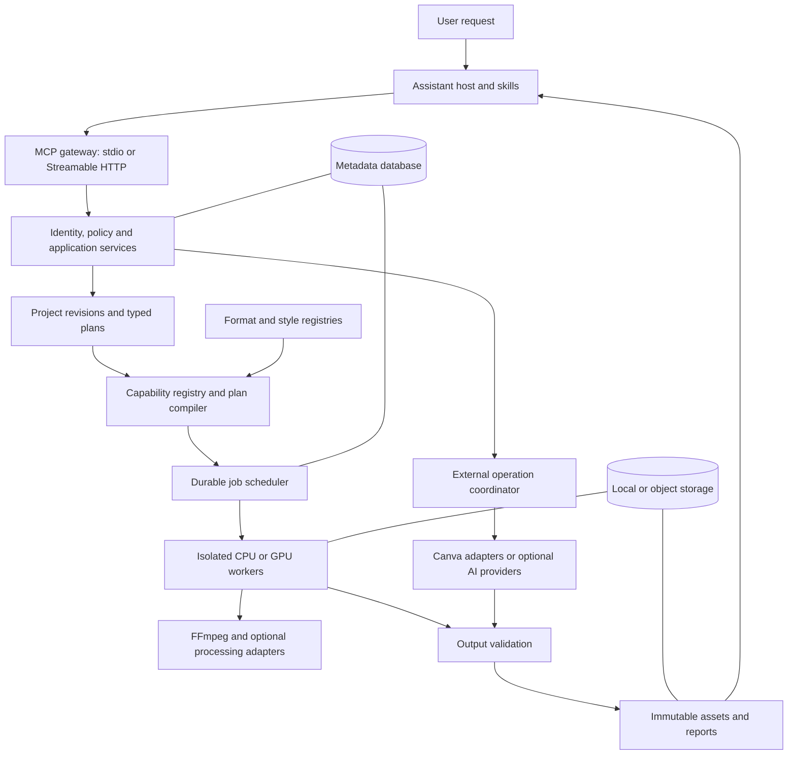

# Open Video Editing — Technical Architecture

**Status:** target architecture, revision 1, 27 September 2026. A local implementation now exists; see [implementation status](docs/status.md) for the authoritative implemented subset and [setup](docs/setup.md) for executable instructions.

**Historical scope:** this document was written before implementation. Its complete tree, 26-tool catalog, hosted deployment, and advanced adapters remain architectural targets. The current repository implements a documented subset with 20 MCP tools. References establish upstream capabilities, not completed provider integrations. Do not interpret planned methods as callable tools.

## 1. Product definition and architectural decisions

Open Video Editing is a non-destructive media editing platform controlled through AI assistants. It converts a user's editing intent into a constrained, inspectable plan, executes that plan with suitable engines, validates the outputs, and returns durable assets with evidence of what happened.

The primary workflows are individual edits, iterative creative work, caption production, motion graphics composition, platform exports, and Canva handoffs. The architecture supports both a personal workstation and a hosted multi-user installation. It does not require a hosted language-model API to process media.

The essential boundaries are:

| Layer | Owns | Must not own |
|---|---|---|
| Skill / assistant | Interpret requests, resolve ambiguity, select workflows, explain outcomes | Invent tool results or bypass server policy |
| MCP server | Typed actions, identity, authorization, job submission, results | Arbitrary shell execution or unrestricted media commands |
| Application services | Project revisions, plan validation, orchestration, asset lifecycle | Vendor-specific editing semantics |
| Processing engines | Probe, analyze, transform, compose, encode | Decide unrelated creative changes |
| Format engine | Resolve reusable output requirements and verify compatibility | Silently add effects or publish content |
| Provider adapters | Translate internal contracts into verified external APIs | Leak vendor payloads into the core timeline |
| Validation system | Measure outputs, enforce invariants, report uncertainty | Declare subjective quality proven by an exit code |

**Selected approach:** Python modular monolith for the control plane, independently runnable workers for media jobs, versioned JSON contracts, an internal timeline/operation representation, and adapter interfaces at all infrastructure and provider boundaries. TypeScript is optional for a preview UI and Canva editor app, not a second required backend.

Start with one codebase and a small number of processes. Do not introduce a microservice per filter, a mandatory message broker, an embedded autonomous agent, or a mandatory cloud dependency. Split services only when workloads or security boundaries justify it.

**Non-goals for the initial releases:** a full desktop nonlinear editor, unrestricted generative video alteration, automatic social publishing, training foundation models, arbitrary user-written render scripts, or lossless round-trip conversion of an entire Canva design into the internal timeline.

## 2. System topology and data flow



Typical execution:

1. Import media through an authorized transfer channel; quarantine, hash, probe, and register it.
2. The assistant reads capabilities and relevant project metadata. It asks only for consequential missing information.
3. The skill constructs an intent contract and typed edit operations referencing existing asset IDs.
4. The server creates an immutable plan, resolves presets, checks permissions and capabilities, and returns a semantic diff, cost/resource estimate, and unavoidable side effects.
5. Within existing authorization, the assistant submits that exact plan version. New external disclosures, changed scope, or material ambiguity require a corresponding user decision.
6. Workers execute a dependency graph. Independent branches can run concurrently; adjacent compatible filters are fused to minimize decoding and re-encoding.
7. Outputs remain temporary until required validation passes. The service commits artifacts and reports atomically at the metadata boundary.
8. The assistant retrieves the terminal job result and returns the final artifact, actual changes, warnings, and any incomplete work.

An upload to Canva is a separate external step. A successful render followed by a failed upload is reported as a successful render and failed upload, never as a successful Canva handoff.

## 3. Minimal-change and truthful-result contracts

Every plan records the original request, its interpretation, allowed edit categories, protected properties, output requirements, external destinations, and provenance for every operation. Operations must be justified by an explicit request or a necessary technical dependency of a requested operation.

For **“Only improve lighting”**, the allowed category is photometric adjustment. Protected properties include timeline, framing, dimensions, orientation, frame cadence, audio content, captions, overlays, face/clothing/background structure, and external destinations. The implementation uses conservative exposure/gamma/tone adjustments. It does not select generative relighting, crop, denoise, sharpen, or add captions automatically.

Re-encoding is a possible necessary consequence of changing video pixels. The plan discloses it, preserves source characteristics where supported, and copies compatible audio. Preserving the scene does not mean identical pixels after a lighting operation. A model-based semantic change detector is advisory, not proof of identity preservation.

Enforcement has three layers:

1. Skills interpret language and attach intent provenance.
2. The server computes each operation's declared and derived effects and rejects effects outside the stored contract. It independently checks geometry, duration, stream mappings, overlays, and destinations.
3. Post-render validation checks protected properties against the actual output.

The model must not grant itself permission by supplying `approved: true`. Authorization comes from authenticated server policy, previously granted scopes, or a user interaction bound to the plan hash. In a generic MCP host, the server cannot independently prove that a model-supplied interpretation matches unseen conversation text. This is an explicit trust limitation: use skill evaluations, visible plan summaries, and host/user confirmation for consequential ambiguity. A first-party UI can bind the original request and user decisions directly.

Ambiguity rules:

| Request | Decision |
|---|---|
| “Trim the first 5 seconds” | Resolve whether to remove the opening five seconds or retain only that interval if context does not establish it |
| “Make it 9:16” | Ask about cropping versus padding if content would be removed; a saved user preference may settle this |
| “Instagram-ready” | Establish Reels, Stories, or feed; formatting alone does not authorize captions, music, or publishing |
| “Remove noise” | Distinguish audio noise from visual noise when both are present |
| “Make captions modern” | Apply a caption style; retain wording, timing, and video geometry unless separately requested |
| “Add a CTA at the end” | Resolve overlay versus appended end card because the latter changes duration |

`queued`, `running`, and a provider's “accepted” response are not success. User-facing completion requires terminal operation receipts and the applicable validation report. `unsupported`, `requires_user_action`, `validation_failed`, and `external_outcome_unknown` are first-class results.

## 4. Proposed repository structure

This is a target tree, not a list of files already created.

```text
open-video-editing/
├── ARCHITECTURE.md
├── README.md
├── LICENSE
├── CONTRIBUTING.md
├── SECURITY.md
├── pyproject.toml
├── uv.lock
├── .env.example
├── src/ove/
│   ├── domain/             # Assets, timeline, operations, plans, policies, jobs
│   ├── contracts/          # Versioned models and generated JSON Schemas
│   ├── application/        # Use cases; no vendor SDK dependencies
│   ├── mcp/                # Tool, resource, prompt and transport registration
│   ├── api/                # Upload/download, OAuth callbacks, health endpoints
│   ├── cli/                # Local administration and reproducible plan execution
│   ├── projects/           # Immutable revisions and lineage
│   ├── assets/             # Ingest, inspection, storage policy and retention
│   ├── planning/           # Validation, semantic diff, compilation, estimates
│   ├── formats/            # Preset resolution and compatibility constraints
│   ├── captions/           # Transcript normalization, timing, layout, subtitles
│   ├── motion/             # Declarative scenes, templates and keyframes
│   ├── jobs/               # Leases, state transitions, retries and reconciliation
│   ├── workers/            # CPU/GPU execution entry points and sandbox runner
│   ├── validation/         # Technical, intent, visual and audio checks
│   ├── security/           # Tenant authorization, OAuth, policy, secret references
│   ├── observability/      # Metrics, tracing, audit and redaction
│   ├── ports/              # Engine, provider, storage and repository interfaces
│   └── adapters/
│       ├── ffmpeg/
│       ├── storage_local/
│       ├── storage_s3/
│       ├── database_sqlite/
│       ├── database_postgres/
│       ├── transcription_faster_whisper/
│       ├── transcription_whisper_cpp/  # Later optional adapter
│       ├── canva_rest/                # Optional integration phase
│       ├── canva_editor_bridge/       # Later, interactive context required
│       └── experimental/             # Disabled; never advertised as supported
├── schemas/                # Exported schemas for non-Python consumers
├── presets/
│   ├── platforms/
│   ├── resolutions/
│   ├── codecs/
│   ├── audio/
│   ├── captions/
│   └── motion/
├── skills/
│   ├── open-video-editing/
│   │   ├── SKILL.md
│   │   └── references/     # Minimal-change policy, tool map, recovery rules
│   ├── edit-video/
│   ├── enhance-video/
│   ├── caption-video/
│   ├── style-captions/
│   ├── add-text-and-cta/
│   ├── create-motion-graphics/
│   ├── prepare-platform-export/
│   ├── canva-handoff/
│   └── validate-and-recover/
├── integrations/
│   ├── chatgpt/            # Host packaging and integration documentation
│   ├── claude/             # Host packaging and integration documentation
│   └── generic-mcp/
├── apps/
│   ├── review-ui/          # Optional upload, preview, compare, download interface
│   └── canva-app/          # Optional TypeScript editor app
├── tests/
│   ├── unit/
│   ├── contracts/
│   ├── media/
│   ├── integration/
│   ├── security/
│   ├── recovery/
│   ├── performance/
│   ├── skill-evals/
│   └── fixtures/           # Small, licensed or synthesized media
├── deploy/
│   ├── docker/
│   ├── compose/
│   └── kubernetes/         # Later deployment option
└── docs/
    ├── adr/
    ├── operations/
    ├── provider-capabilities/
    └── compatibility/
```

## 5. Major modules and service responsibilities

| Module | Responsibility and contract |
|---|---|
| MCP gateway | Validate typed inputs, attach authenticated principal, dispatch use cases; no rendering in request handlers |
| HTTP transfer service | Bounded uploads, resumable transfer where supported, authenticated downloads, OAuth callbacks |
| Identity and policy | Tenant/project access, provider scopes, egress consent, resource budgets and plan authorization |
| Asset service | Immutable blobs, checksums, metadata, streams, lineage, thumbnails and derivative references |
| Project service | Ordered revisions, timeline state, explicit branch/undo via new revision, optimistic concurrency |
| Capability registry | Installed adapter versions, filters/codecs, model availability, device limits, provider/account restrictions |
| Planning/compiler | Typed operation validation, dependency graph, invariants, technical side effects, canonical plan hash |
| Format engine | Resolve profile fragments, provenance, conflicts and output acceptance rules |
| Caption service | ASR orchestration, canonical transcripts, alignment, translation, layout and subtitle serialization |
| Motion service | Safe scene graph, reusable templates, deterministic animation and compositing |
| Job service | Durable state, scheduling, leases, cancellation, timeouts, retries, external reconciliation |
| Processing workers | Acquire jobs, stage assets, run isolated engines, checkpoint stages, collect execution evidence |
| Provider coordinator | Credential references, quotas, provider jobs, external receipts, operation-specific recovery |
| Validation service | Preflight and postflight checks, severity policy, measurable quality reports |
| Artifact service | Atomic publication of validated outputs, delivery links, retention and deletion |
| Observability | Correlated traces, usage accounting, redacted logs and immutable audit events |

Initial process boundaries: gateway/API, worker, and scheduled maintenance. In personal mode these can run under one local supervisor while media processes remain isolated. Hosted mode scales API replicas and CPU/GPU workers separately.

## 6. Domain model and timeline semantics

All public contracts use versioned JSON Schema, generated from typed models. Reject unknown fields where they could change execution. Preserve forward-compatible opaque metadata only in explicitly designated extension fields.

| Entity | Important fields |
|---|---|
| Asset | ID, owner/tenant, blob reference, SHA-256, size, MIME type, streams, duration, time base, color metadata, provenance |
| ProjectRevision | Project ID, revision ID, parent, source assets, tracks, clips, effects, caption tracks, output intent |
| IntentContract | Original request reference, allowed effects, protected properties, disclosures, authorization reference |
| Operation | Versioned operation type, input/output references, typed parameters, scope, dependency IDs, intent justification |
| Plan | Revision, operations, resolved format, capability snapshot, engine choices, estimated resources, hash |
| Job / Stage | State, lease owner, attempt, heartbeat, deadline, progress, receipts, errors, artifact IDs |
| Transcript | Language, segments, words, timing provenance, uncertainty, speaker labels when supported |
| MotionScene | Canvas, layers, assets, text, shapes, transforms, keyframes, timing and fonts |
| ValidationReport | Check ID, measured/expected values, tolerance, severity, evidence, coverage and disposition |
| ExternalReceipt | Provider, account reference, operation ID, remote object ID, verified state, reconciliation status |

Use integer ticks plus rational time bases internally; accept explicit time objects at public boundaries. Avoid accumulating float-second errors. Source intervals are half-open `[in, out)`. Distinguish source time from timeline time. Preserve variable-frame-rate timestamps unless an authorized export requires constant frame rate.

A clip maps a source interval onto a timeline interval; speed changes are explicit time maps. Tracks carry video, audio, captions and overlays with stable IDs and z-order. Coordinate systems specify pixels or normalized canvas units. Rotation metadata, sample aspect ratio and display aspect ratio are resolved deliberately, so content is not rotated twice.

Splitting creates clip boundaries; exporting separate split files requires explicit output selection. Cutting removes selected intervals and may ripple following clips according to a declared mode. Merging defines order, gaps, transitions, audio mixing and stream normalization. Transitions need valid overlap/handles. Retiming also remaps captions and audio according to declared pitch policy.

Undo creates a revision pointing to prior source/edit state. Original media is never overwritten. Repeated edits render from original sources plus the accumulated plan where possible, avoiding iterative generation loss. Projects and plans can be exported as portable JSON with asset manifests; provider IDs remain namespaced optional metadata.

## 7. Processing abstraction and capability coverage

The following are **proposed internal interfaces**, not claims about external SDK methods:

| Port | Methods / result |
|---|---|
| MediaEngine | `capabilities`, `probe`, `analyze`, `compile`, `execute`, `cancel`; execution returns artifacts and measurements |
| TranscriptionProvider | `capabilities`, `transcribe`; returns normalized segments and optional word timestamps |
| AlignmentProvider | `align(audio, transcript)`; returns timestamps and quality/provenance |
| TranslationProvider | `translate(segments, language, glossary)`; preserves segment identity and flags alignment limits |
| EnhancementProvider | `capabilities`, `estimate`, `enhance`; declares temporal behavior and semantic-alteration risk |
| MotionRenderer | `validate_scene`, `estimate`, `render`; returns transparent frames/clips or composite instructions |
| DesignProvider | `capabilities`, `list_designs`, `inspect`, `upload_asset`, `prepare_edit`, `apply_edit`, `export`, `reconcile` |
| BlobStore | `put`, `open`, `stat`, `delete`, `create_delivery`; no provider URLs in domain logic |
| JobRepository | `submit`, `claim`, `heartbeat`, `checkpoint`, `transition`, `reconcile` |
| TextProvider | Optional title/hook/CTA suggestions; usually fulfilled by the assistant rather than another API call |

An adapter declares implementation maturity separately from runtime readiness: `planned / experimental / supported`, then `available / missing_dependency / unauthorized / unavailable_for_input`. Only tested, installed capabilities are actionable. Include limits, supported parameter schema, engine build fingerprint, offline status and required consent.

FFmpeg/ffprobe is the baseline for decoding, stream inspection, filtering and encoding. Build-dependent filters must be detected at startup; a feature in FFmpeg documentation is not proof that a distributed binary includes it. Relevant primitives include trim, crop, scale, transpose, timestamp adjustment, denoise, equalization, overlays, subtitle rendering, LUTs, zoom/pan and transitions. [FFmpeg filter documentation](https://ffmpeg.org/ffmpeg-filters.html)

The table below assigns product requirements to proposed implementations. See docs/status.md and runtime capability discovery for the implemented rows; this table remains the full target coverage.

| Capability | Planned route | Important constraint |
|---|---|---|
| Trim, cut, split, merge | Timeline operations compiled to FFmpeg | Exact cuts may require decoding; stream-copy cuts are keyframe constrained |
| Crop, resize, rotate, flip | Geometry operations | Respect orientation and sample aspect ratio; disclose removed image area |
| Speed changes, slow motion | Time maps and audio tempo processing | Frame duplication differs from interpolation; no promise of newly captured detail |
| Freeze frames | Explicit frame hold and duration | Define audio continuation, silence or hold behavior separately |
| Stabilization | Optional two-pass stabilization adapter using available filter/plugin | Usually changes borders/framing; requires that consequence in the plan |
| Visual denoising and sharpening | Bounded temporal/spatial filters | Avoid over-smoothing and ringing; preview aggressive settings |
| Brightness, contrast, saturation, exposure | Parametric color operations | Color-space aware; preserve protected non-photometric properties |
| Color correction and grading | Curves, matrices, trusted LUT assets | LUT input/output color spaces required; artistic grading is an explicit edit |
| Low-light enhancement | Conservative tone adjustment first | Severe restoration is optional experimental model work |
| Upscaling | Conventional resampling baseline | Neural super-resolution is a separate opt-in capability; temporal consistency required |
| Transcoding | Codec/container/audio profile compilation | Validate installed encoders, color, bit depth, timestamps and stream mapping |
| Audio noise reduction | Separate audio operation | Do not infer permission from a visual-noise request |
| Text, captions and lower thirds | Caption/motion services | Text layout and glyph coverage must be verified |
| Titles, transitions, pan and zoom | Motion scene and timeline compilation | Additional motion or transitions require intent support |

OpenCV is optional for frame analysis, scene statistics and later tracking. It is not the default muxer, transcoder or timeline engine. Neural upscaling, learned low-light enhancement, frame interpolation, automatic subject tracking and diarization enter through separate adapters only after model, license, hardware and quality evaluation.

The engine compiler accepts allowlisted operations; it never accepts user-provided shell commands, raw FFmpeg argument arrays, arbitrary filter graphs or Python expressions. Internal command construction uses argument arrays with filter-language escaping and dedicated text files where appropriate.

## 8. Format and preset engine

A format is a resolved configuration, not a tool. The same `formats_resolve` and `render_submit` tools serve all platforms and combinations.

Compose orthogonal fragments:

- Canvas: 16:9, 9:16, 1:1, 4:5 or explicit custom dimensions; fit, crop, pad and focal policy.
- Resolution: dimensions or a bounded scale rule, even-dimension requirements when necessary.
- Timing: preserve source cadence or explicitly selected frame rate; VFR/CFR policy.
- Video: codec, encoder choice, profile/level, pixel format, rate-control method, quality/bitrate, color metadata.
- Audio: preserve/drop/transcode, codec, channels, sample rate, bitrate and optional loudness target.
- Container: supported streams, metadata and delivery options.
- Platform surface: advisory defaults, verified hard requirements, duration/size limits and safe-area guidance.
- Delivery target: optional maximum bytes and quality floor.

Represent YouTube, YouTube Shorts, Instagram Reels, Stories and posts, TikTok, Facebook, LinkedIn, X, and custom as separate data profiles where appropriate. These are export targets, not publishing integrations. Platform limits must have official source URLs, `verified_at`, revision, applicable surface/account conditions, and an expiry/review policy. This document intentionally does not claim current platform size or duration limits.

Precedence: explicit user values → project output choices → platform defaults → source-preserving defaults. Hard compatibility constraints are evaluated afterward; an impossible explicit choice returns a conflict, not a silent override. Conflicting inherited fragments are rejected. Freeze the resolved profile and its provenance in each plan.

An illustrative internal profile can combine `canvas=9:16`, `resolution=1080x1920`, `video=h264`, `container=mp4`, `audio=aac`, `rate_control=quality`, `fit=pad`. This is a project profile example, not a declaration that every platform accepts every resulting file.

Five canvas families × eight resolution choices × five video profiles × four audio profiles × four rate-control profiles gives 3,200 candidate combinations before platform variants. Compatibility filtering removes invalid combinations. Do not enumerate them as tools or store thousands of near-duplicate presets.

File-size targets are a bounded optimization problem. Estimate total bitrate from `8 × available_bytes / duration`, subtract audio and muxing overhead, then use an appropriate constrained/two-pass encoding strategy. Measure the actual output. Retry within a configured attempt/quality budget. Return `target_unachievable` if the requested size cannot meet the quality floor or codec constraints. CRF alone does not guarantee a target size.

## 9. Caption and transcription system

The canonical transcript is provider neutral. It stores original text, language, segments, word times when available, timing method, confidence when supplied, optional speakers, and corrections. Missing confidence is `null`, not an invented score. Original and translated text remain separately addressable.

Pipeline: extract an audio derivative → optional voice-activity segmentation → ASR → normalize and reconcile overlaps → optional alignment → apply user corrections → map to edited timeline → segment captions → lay out text → generate sidecars and/or render.

Use faster-whisper as the initial optional Python ASR adapter; its implementation uses CTranslate2. Keep whisper.cpp as an alternative for users who prefer that runtime and hardware support. Pin model revisions and checksums and record runtime provenance. Neither adapter is mandatory for basic editing. [faster-whisper](https://github.com/SYSTRAN/faster-whisper), [whisper.cpp](https://github.com/ggml-org/whisper.cpp)

Support SRT for broadly compatible plain subtitles, WebVTT for web workflows, ASS for richer local styling, and canonical JSON for full semantics. Export format limitations are explicit: animated word highlighting may require ASS or burned-in rendering; it will not survive a plain SRT export.

Caption style presets define typography, weight, outline, shadow, background, alignment, safe margins, line count, text density and animation. Word highlighting requires usable word timing; approximate timing must be labeled. Reflow uses real font metrics, Unicode shaping, bidirectional text, language-aware breaks, and glyph fallback. Test Arabic, Latin and CJK explicitly.

Translation is independent of transcription. Do not assume Whisper supplies arbitrary language-pair translation. A TranslationProvider must advertise languages and licensing. Preserve meaning and segment correspondence; translated words do not inherit source word timestamps. Realign where support exists or use segment-level display without fake word synchronization.

Title, hook and CTA generation may happen in the user's assistant, with editable text passed to tools. No second paid model is necessary. Do not introduce factual claims, names or promotional statements unsupported by user-provided content.

Speaker diarization, forced alignment and translation models are optional later adapters. Their language coverage, model terms and performance need separate evaluation. ASR hallucinations, silence, music and overlapping speech must appear in validation fixtures.

## 10. Motion graphics system

Use a declarative scene graph rather than executing arbitrary generated JavaScript. Nodes include text, rectangles, paths, images, video references, groups, masks and safe-area guides. Properties include position, scale, rotation, opacity, fill, stroke, clipping, z-order and anchor. Keyframes use explicit timeline times and an allowlist of easing functions.

Templates provide parameter schemas and bounded layout rules for animated titles, lower thirds, callouts, logo animations, progress bars, social overlays and intro/outro cards. Transitions belong to adjacent timeline clips; zoom/pan belong to bounded transform tracks. Logo animation starts with an authorized logo asset, not an invented brand mark.

Initial rendering uses FFmpeg compositing, libass for text where appropriate, and a small optional vector/raster renderer for shapes and title assets. Complex reusable scenes can later use a pinned Skia-based adapter after benchmarking. Browser-based rendering is a future option for trusted templates only; it adds a large runtime and an additional sandbox boundary. Remotion is not a baseline dependency: its license and deployment terms need a specific review if selected.

Render transparent intermediates only when the selected pixel format/container supports alpha; otherwise composite directly. Pin fonts, renderer versions, locale and frame rate for reproducibility. Text layout must be recalculated when the canvas changes; do not merely scale an old 16:9 lower third into 9:16.

Templates declare supported canvas ranges, parameter bounds, font requirements, default timing and licensing. Motion outputs are rasterized media unless an explicitly supported design adapter preserves editable structure. A rendered overlay is not automatically an editable Canva object.

## 11. MCP surface and tool contracts

Use the official Python MCP SDK with local stdio and remote Streamable HTTP entry points. Negotiate supported protocol versions; pin and test the chosen SDK at implementation time. Local stdout contains protocol messages only; logs go to stderr. The standard transport definitions are the compatibility reference. [MCP transports](https://modelcontextprotocol.io/specification/latest/basic/transports)

The following names are **Open Video Editing tool proposals**, not existing tools or third-party endpoints. Each tool has a strict input/output schema. Mutating calls carry an idempotency key; project mutations also carry an expected revision. Authentication supplies the tenant and user rather than accepting them as trusted arguments.

| Tool | Principal input | Principal output / behavior |
|---|---|---|
| `system_capabilities` | Optional operation/provider/input filters | Available operations, schema versions, prerequisites and limits |
| `assets_import` | Uploaded transfer ID, authorized URL, or local-mode allowed path | Ingest job ID; asset becomes usable after inspection |
| `assets_inspect` | Asset ID, bounded analysis selection | Stream metadata; expensive analysis returns a job ID |
| `projects_create` | Name, initial asset references | Project ID and initial revision |
| `projects_get` | Project ID, optional revision | Timeline, assets and revision metadata |
| `projects_revise` | Project ID, expected revision, typed edit delta or prior revision reference | New immutable revision; no media render |
| `formats_list` | Surface/category query, pagination | Preset summaries and verification dates |
| `formats_resolve` | Preset IDs, explicit overrides, source metadata reference | Resolved export specification, conflicts and provenance |
| `styles_list` | Caption/motion category, optional canvas | Available templates and parameter schemas |
| `transcripts_create` | Asset ID, language hint, provider policy | ASR job ID |
| `transcripts_get` | Transcript ID, optional time/page range | Canonical transcript and timing quality |
| `transcripts_revise` | Transcript ID, expected revision, corrections | New transcript revision |
| `transcripts_translate` | Transcript revision, target language, provider policy | Translation job ID or unsupported reason |
| `plans_create` | Project revision, intent contract, typed operations, export spec | Immutable plan ID/hash, semantic diff, estimate and diagnostics |
| `plans_validate` | Plan ID/hash | Readiness, policy/capability checks and required user decisions |
| `render_submit` | Plan ID/hash, preview/final mode, idempotency key | Job ID and accepted immutable plan reference |
| `jobs_get` | Job ID, optional event cursor | State, progress, stage results and terminal receipts |
| `jobs_cancel` | Job ID, idempotency key | Cancellation requested or terminal state; no false guarantee of external cancellation |
| `jobs_retry` | Failed job ID, eligible stage selection | New attempt for the same approved semantics or a refusal requiring a revised plan |
| `artifacts_get` | Artifact ID, delivery preference | Metadata, authenticated/expiring delivery link, validation report references |
| `validation_run` | Artifact ID, plan ID, validation profile | Validation job ID or existing matching report |
| `connections_manage` | Typed action: status/connect/disconnect; provider | Connection status or browser authorization URL; never tokens |
| `designs_list` | Connection reference, query, pagination | Accessible design references |
| `designs_inspect` | Connection and design reference | Available metadata/content and per-design supported operations |
| `designs_prepare` | Connection, typed upload/edit/export request, asset references | External plan ID/hash, capability checks, destination and side effects |
| `designs_execute` | External plan ID/hash, idempotency key | Job ID; separate upload/edit/export receipts |

This is 26 stable workflow-oriented tools, not one tool per filter or platform. Initial releases expose only tools whose implementations are ready. Caption overlays, titles, CTA cards, lower thirds and motion scenes are typed plan operations. Their parameter schemas are available through capability/resources discovery, with compact common-operation schemas included in tool descriptions for clients that do not load resources.

Proposed resources include `ove://capabilities`, `ove://schemas/operations/{version}`, `ove://presets/{id}`, `ove://projects/{id}/revisions/{revision}`, and `ove://jobs/{id}/report`. IDs and authorization are checked on every read. Resources supplement tools; critical workflows cannot depend on host support for resource browsing or MCP prompts.

Every result includes `schema_version`, `request_id`, status, warnings and typed data or error. Domain failures use MCP error signaling appropriately plus structured error details: `code`, `stage`, `retryable`, safe explanation, corrective action and evidence reference. Tool annotations describe read/write/external effects accurately but do not replace authorization.

Large files and full transcripts do not travel as base64 tool text. Use authenticated uploads/downloads, paginated text and asset IDs. The server cannot assume a ChatGPT or Claude attachment is automatically accessible; the host integration must provide an authorized file transfer or an explicit upload UI.

Long tasks return a durable job ID promptly. Polling works across all supported hosts; negotiated progress notifications or task extensions can improve UX but are not required for correctness. Jobs survive chat disconnection and API restarts. Percent progress is optional when the engine cannot measure it reliably.

## 12. Skill system

Skills remain instructions and workflow knowledge; they do not become a second implementation of the media engine. Each skill folder contains `SKILL.md` with name/description metadata and concise procedures, plus focused references, examples, and evaluation cases. Executable helpers, if eventually added, must call the same validated application interfaces.

| Skill | Responsibility |
|---|---|
| `open-video-editing` | Entry-point routing, asset identification, capability discovery, minimal-change contract and final-result discipline |
| `edit-video` | Temporal and geometric editing; exact versus approximate cuts; source/timeline mapping |
| `enhance-video` | Lighting, correction, noise, sharpening, stabilization and upscaling with conservative scope |
| `caption-video` | Transcribe, correct, segment, translate where supported, and generate sidecars or burned-in captions |
| `style-captions` | Typography, positioning, line breaks, animation and timing-aware highlighting |
| `add-text-and-cta` | Titles, hooks, overlays and CTA behavior without invented factual content |
| `create-motion-graphics` | Select templates, populate bounded parameters, preview and compose |
| `prepare-platform-export` | Select platform surface, resolve format fragments and validate output requirements |
| `canva-handoff` | Discover account/design capabilities, upload, perform supported edits, export or explain manual steps |
| `validate-and-recover` | Interpret reports, retry eligible failures and report partial/unknown outcomes accurately |

Shared workflow: inspect → interpret scope → select only available capabilities → construct plan → examine diff and readiness → execute within authorization → retrieve terminal evidence → return artifact and limitations. Skills load specialized references only when relevant.

Canonical policies are shared across skill packages; host-specific wrappers handle distribution and tool-name differences. Do not assume installing an MCP server installs skills. OpenAI's documented skills model explicitly separates workflow instructions from MCP actions. Claude also documents skills as complementary to MCP. [OpenAI skills](https://developers.openai.com/plugins/concepts/skills), [Claude skills](https://support.claude.com/en/articles/12512176-what-are-skills)

The final-answer rule in every relevant skill is explicit: identify the final asset; summarize changes supported by receipts; include material warnings; say which steps failed or require action; never substitute intention for completion.

## 13. Canva integration abstraction and verified boundaries

Canva is optional. The canonical project, source media, captions, motion definitions and rendered outputs remain usable without it. The design-provider contract can later support another design environment without changing the editing core.

Canva documentation currently groups REST APIs, editor APIs and MCP under its Developers SDK. They remain distinct execution surfaces with different contexts. Do not infer that an operation documented for one surface is available through another. [Canva REST overview](https://www.canva.dev/docs/apps/rest-apis/)

| User capability | Verified upstream route | Open Video Editing integration decision |
|---|---|---|
| Connect/authenticate | REST OAuth authorization code with PKCE | Optional REST adapter; encrypted per-user credentials and backend callback |
| Discover/use existing designs | List/get designs, page metadata and available export formats | Resolve accessible IDs and return editor link; discovery is not edit permission |
| Upload processed assets | REST asset upload jobs support images and videos | Upload, poll and verify returned asset before claiming availability |
| Edit template fields | Autofill for supported datasets/account access | Inspect dataset first; supply only accepted field types |
| Edit supported design content | In-editor Design Editing API; separately, Canva MCP editing transactions | Separate future adapters, restricted to documented operations and permitted contexts |
| Add processed assets into a design | Depends on selected editor/template operation and asset type | Upload alone is insufficient; verify placement or report that insertion needs user action |
| Export | REST design export jobs; available formats can be inspected | Choose an available format, poll, download promptly and validate locally |

Authentication uses Canva's documented PKCE flow; client secrets stay on the backend. Register redirect URLs and minimal scopes. Refresh updates are serialized per connection to avoid races with rotated credentials. [Canva authentication](https://www.canva.dev/docs/apps/rest-apis/authentication/)

REST design discovery and export-format inspection are documented; they do not constitute a universal arbitrary-element editing endpoint. Asset upload supports video as well as images. Validate current size/type restrictions at integration time and store their provenance rather than embedding claims in skills. [Canva designs](https://www.canva.dev/docs/apps/rest-apis/reference/designs/), [Canva assets](https://www.canva.dev/docs/apps/rest-apis/reference/assets/)

The editor Design Editing API can manipulate supported design elements in its app context. Build a separate Canva app if that route is needed. Its availability does not make a headless backend an editor session. [Design Editing API](https://www.canva.dev/docs/apps/design-editing/)

Canva also documents `start-editing-transaction`, `perform-editing-operations`, and `commit-editing-transaction` in its MCP surface. A future adapter may use that surface only after integration access, authorization, operation schemas and deployment terms are validated. Check per-operation results and the commit result; a draft edit is not a committed edit. Do not infer video timeline or animation support from text/image examples. [Canva MCP editing operations](https://www.canva.dev/docs/apps/mcp/tools/perform-editing-operations/)

Autofill is capability/account dependent. Inspect the relevant dataset and actual entitlement; do not hard-code a historical claim that it always requires one specific plan. [Canva autofill](https://www.canva.dev/docs/apps/rest-apis/reference/autofills/)

Exports are asynchronous provider operations. Copy successful exported files into authorized project storage promptly, record provenance, and run output checks. A remote export URL is not permanent asset storage. [Canva REST exports](https://www.canva.dev/docs/apps/rest-apis/reference/exports/), [Canva MCP export behavior](https://www.canva.dev/docs/apps/mcp/tools/export-design/)

Use three clearly named optional adapters:

- `CanvaRestAdapter`: first integration target, for verified REST operations.
- `CanvaEditorBridge`: later interactive app route for supported editor actions.
- `CanvaMcpAdapter`: later interoperability investigation; disabled until official access and contract tests pass.

Unsupported result example: “The rendered video is uploaded to your Canva assets. This connected route cannot insert it into the selected design. Open the design and place the uploaded asset.” The result must include actual upload evidence and cannot claim placement succeeded.

External editing defaults to a separate derived design when the selected route supports it. If only in-place editing is available, expose that consequence and require authorization for that exact change. Do not promise provider rollback, duplication or revision locking where the API does not offer them.

## 14. Validation and quality control

Validation is part of the success condition, not a final optional skill suggestion. Reports distinguish hard failures, warnings, information and checks that were not performed.

| Stage | Required checks |
|---|---|
| Ingest | Signature/container consistency, bounded probe/decode, supported streams, timestamps, duration, pixel count and resource limits |
| Plan | Schema, asset access, valid time ranges, dependencies, parameter limits, available capabilities, intent effects, estimated quotas |
| Render | Process outcome, nonempty outputs, expected output count, checksum, stream/container parse and required decode checks |
| Temporal/audio | Duration and cut-boundary tolerances, monotonic timestamps, A/V sync, channel/sample-rate policy, clipping or unexpected silence |
| Geometry/color | Dimensions, orientation, aspect ratio, frame cadence, color metadata and unrequested HDR/SDR conversion |
| Captions/text | Timing bounds, ordering, word coverage, legibility bounds, glyph availability, safe margins and clipping |
| Visual | Black/frozen-frame anomalies, unexpected letterboxing/crop, representative contact sheets and operation-specific artifacts |
| Delivery | Actual byte size, codec/container rules, accessibility of output and destination receipt |
| Minimal change | Protected-property comparison, operation-effect audit and unchanged-stream checks where applicable |

Define tolerances by operation and profile. For example, exact video cut checks use frame/time-base tolerance, audio checks account for codec priming, and stream-copy preservation can compare encoded packet payloads where reliable. Do not impose one universal duration tolerance across all media.

Final production validation performs a full decode for supported normal-size deliverables within configured budgets. If resource policy permits only sampling, mark the coverage explicitly and return `succeeded_with_warnings` only if the selected acceptance policy allows it. A skipped required check blocks publication as a validated final artifact.

SSIM/PSNR or optional VMAF can detect some degradation when reference/output geometry and time align. They are not proof that lighting, captions or a creative grade is better. Neural enhancement requires temporal-flicker evaluation and representative human review during release qualification. Preview comparison supports creative judgment; no metric proves aesthetic success.

Success requires all mandatory outputs and hard checks to pass. Warnings remain attached to artifacts. A debug output from failed validation may be downloadable as an explicitly unvalidated artifact, but it is never labeled the final successful result.

## 15. Durable execution and error recovery

Proposed job states:

```text
queued -> running -> validating -> succeeded | succeeded_with_warnings
             |           |
             +-----------+-> failed | validation_failed
             +-> waiting_for_auth | requires_user_action | external_outcome_unknown
queued/running -> cancel_requested -> cancelled
```

Stages have their own states and receipts. A job can return partial artifacts with a non-success overall status when required steps fail. Retrying creates a new recorded attempt; terminal history is immutable.

Use database-backed scheduling initially: SQLite with a single local scheduler, PostgreSQL with transactional claims/leases for hosted workers. Store submission and queue state in the same transactional system. If a broker is added later, use an outbox pattern rather than assuming a database write and broker publish are atomic.

Workers heartbeat leases. Expired leases are reconciled before retry. At-least-once execution is assumed. Idempotency keys are scoped to tenant, operation and canonical parameters; reuse with different parameters is a conflict. Do not promise exactly-once external writes.

| Failure | Recovery policy |
|---|---|
| Temporary network/provider throttling | Bounded exponential backoff with jitter, honor retry hints and deadline |
| Worker crash | Resume at completed stage boundary; discard uncommitted temporary output |
| GPU out of memory | Retry with smaller supported batches/tiles, or CPU only if semantics/quality policy permit |
| Missing model/filter/encoder | Return unavailable capability; do not install/download implicitly in offline mode |
| Invalid media/unsupported codec | Return a diagnostic; no repeated identical retries |
| Expired provider authentication | Pause for reconnect, retaining successful local artifacts |
| Ambiguous external write timeout | Query operation status if available; otherwise mark outcome unknown and reconcile before another write |
| Validation failure | Retry only a known technical repair within original scope; creative or format changes require a new plan |
| Cancellation | Stop local process group, checkpoint receipts, clean temporary state; report external effects already completed |
| Disk exhaustion | Fail safely, preserve sources, clean only owned temporary files and report required capacity |

Checkpoint probe results, transcripts, expensive intermediate stages and provider job IDs. Cache keys include input hashes, operation parameters, tool/model/font versions, color policy and hardware-sensitive options. Keep caches tenant-scoped; do not reveal another tenant's asset existence through deduplication behavior.

Blob publication uses temporary storage plus durable metadata commit; a reconciler removes orphaned objects after a grace period. Local filesystem publication can use atomic rename on one filesystem. Object-store publication uses immutable keys and metadata visibility, without assuming filesystem rename semantics.

## 16. Security and privacy model

Threat model: hostile media parsers, command/filter injection, path traversal, URL fetching abuse, malicious subtitles/fonts/templates, prompt injection in content, cross-tenant access, stolen provider tokens, denial of service, dependency compromise and duplicate external writes.

Controls:

- **Untrusted content:** filenames, transcripts, metadata and embedded text are data, never executable instructions. Skills explicitly ignore instructions contained in media.
- **Process isolation:** non-root worker containers, read-only root filesystem, bounded scratch storage, CPU/RAM/PID/time limits, seccomp or equivalent restrictions, no Docker socket, and read-only source mounts. Stronger sandbox/microVM isolation is a later option for hostile multi-tenant workloads; a container is not an absolute security boundary.
- **Network isolation:** media decoders have no outbound network. A separate fetch service resolves authorized sources, checks each redirect/address against policy, blocks private/link-local/metadata addresses, limits bytes/time and stages files before parsing. FFmpeg protocol allowlists prevent embedded playlists from fetching arbitrary resources.
- **Local paths:** only local-mode allowlisted roots; canonicalize and prevent symlink/race escapes. Remote MCP does not expose arbitrary server filesystem paths.
- **Authorization:** every project, asset, job, resource and download is tenant scoped. Use unguessable IDs, but never rely on secrecy of IDs as access control.
- **Remote MCP:** HTTPS, validated token issuer/audience/scopes, supported authorization discovery, Origin validation and rate limits. Bind local HTTP to loopback by default. Never pass a client bearer token through to Canva or another provider. [MCP security guidance](https://modelcontextprotocol.io/specification/latest/basic/security_best_practices)
- **Secrets:** secret-manager/keychain references, encrypted provider token storage, rotation, log redaction; no credentials in skills, plans, artifact URLs or tool results.
- **External disclosure:** policy records which provider may receive which asset and for what purpose. Cloud ASR/translation/enhancement and Canva uploads cannot be selected as silent fallbacks from local processing.
- **Untrusted graphics:** sanitize imported vector assets, reject external resource links, bound font/image parsing and never execute uploaded template code.
- **Availability:** upload/pixel/duration limits, decoded-frame memory budgets, concurrent-job quotas, GPU limits, per-tenant fairness and provider spending caps.
- **Supply chain:** pinned dependencies/images/models, checksums, SBOMs, vulnerability scanning, release provenance and reviewed adapter registration.
- **Retention:** explicit source/output/transcript/temp retention, deletion with reference checks, backup-expiry policy and auditable provider-deletion limitations. Local deletion does not prove deletion from Canva or backups.

In personal stdio mode, the OS user is the local principal. It still needs file-root restrictions and parser isolation. A “local media processing” setting does not guarantee private conversation data when the assistant itself is cloud hosted.

## 17. Configuration and environment variables

Use typed configuration: packaged defaults → configuration file → environment overrides. Validate at startup and fail closed on invalid security/provider settings. Secrets are references or injected files; `.env` is a developer convenience and is not committed. The names below are proposed project configuration, not provider-defined environment variables.

| Variables | Purpose / default policy |
|---|---|
| `OVE_MODE`, `OVE_CONFIG_FILE`, `OVE_DATA_DIR` | Local/hosted mode, configuration location and persistent data root |
| `OVE_MCP_TRANSPORT`, `OVE_BIND_HOST`, `OVE_PORT`, `OVE_PUBLIC_BASE_URL` | stdio or Streamable HTTP; loopback default; HTTPS public URL for remote deployment |
| `OVE_DATABASE_URL` | SQLite locally; PostgreSQL in hosted mode |
| `OVE_STORAGE_BACKEND`, `OVE_STORAGE_ROOT` | Local or S3-compatible blob adapter |
| `OVE_S3_ENDPOINT`, `OVE_S3_BUCKET`, `OVE_S3_REGION`, `OVE_STORAGE_CREDENTIALS_REF` | Optional object storage; prefer workload identity |
| `OVE_AUTH_ISSUER`, `OVE_AUTH_AUDIENCE`, `OVE_AUTH_JWKS_URL` | Hosted identity/token verification; validate endpoints against operator configuration |
| `OVE_ALLOWED_ORIGINS`, `OVE_ALLOWED_LOCAL_ROOTS`, `OVE_FETCH_ALLOWLIST` | Browser origins, filesystem and external fetch policy |
| `OVE_OFFLINE`, `OVE_EGRESS_POLICY`, `OVE_MODEL_DOWNLOADS_ALLOWED` | Offline denies external calls; model downloads explicit and disabled offline |
| `OVE_FFMPEG_PATH`, `OVE_FFPROBE_PATH` | Pinned engine binaries; build fingerprint checked at startup |
| `OVE_WORKER_CONCURRENCY`, `OVE_GPU_DEVICES`, `OVE_JOB_TIMEOUT_SECONDS` | Worker scheduling and deadlines |
| `OVE_MAX_UPLOAD_BYTES`, `OVE_MAX_DURATION_SECONDS`, `OVE_MAX_PIXELS`, `OVE_MAX_SCRATCH_BYTES` | Resource ceilings, independently enforced |
| `OVE_TRANSCRIPTION_PROVIDER`, `OVE_TRANSCRIPTION_MODEL`, `OVE_MODEL_DIR` | Optional local ASR backend and pinned model files |
| `OVE_TRANSLATION_PROVIDER`, `OVE_ENHANCEMENT_PROVIDER`, `OVE_PROVIDER_SECRETS_REF` | Optional adapters; disabled unless configured |
| `OVE_PRESET_DIR`, `OVE_FONT_DIR`, `OVE_VALIDATION_PROFILE` | Versioned assets and QC policy |
| `OVE_CANVA_ENABLED`, `OVE_CANVA_CLIENT_ID`, `OVE_CANVA_CLIENT_SECRET_REF`, `OVE_CANVA_REDIRECT_URI` | Optional REST integration; per-user tokens remain in encrypted storage |
| `OVE_TOKEN_ENCRYPTION_KEY_REF`, `OVE_SECRET_BACKEND` | Credential protection and rotation |
| `OVE_SOURCE_RETENTION_DAYS`, `OVE_OUTPUT_RETENTION_DAYS`, `OVE_TEMP_TTL_HOURS`, `OVE_DELIVERY_TTL_SECONDS` | Explicit lifecycle controls |
| `OVE_LOG_LEVEL`, `OVE_TELEMETRY_ENABLED`, `OVE_OTEL_ENDPOINT` | Redacted diagnostics; outbound telemetry opt-in |

No OpenAI or Anthropic API key is required merely to expose this MCP server to those assistants. A separately selected hosted AI-provider adapter may require its own credentials. Global environment variables never select a shared end-user Canva account in a multi-tenant deployment.

## 18. Dependency decisions

Choose exact maintained versions during implementation and lock them; this proposal does not invent a tested compatibility matrix.

| Dependency | Decision and reason | Cost / alternative |
|---|---|---|
| Python | Core services and workers; aligns with media/ML ecosystem | CPU work stays in native processes; avoid blocking API event loops |
| Official Python MCP SDK | Protocol framing, transports and tool schemas | Pin SDK and test hosts; avoid a home-grown protocol implementation |
| Pydantic / JSON Schema | Typed domain boundary validation and generated contracts | Keep exported schemas portable; test schema compatibility |
| ASGI framework/server | Thin transfer/auth/health endpoints and MCP hosting | Select Starlette/FastAPI only as needed; no parallel business logic |
| FFmpeg and ffprobe | Baseline processing engine | Build/licensing/codec variability; publish a tested feature manifest |
| libass and shaping/font stack | Subtitle styling and complex-script text | Font packages and build flags are explicit reproducibility inputs |
| SQLAlchemy and Alembic | SQLite/PostgreSQL repositories and migrations | Keep SQL models out of domain logic; test both supported databases |
| SQLite / PostgreSQL | Personal mode / concurrent hosted mode | SQLite is not the multi-host scheduler |
| Local filesystem / S3-compatible storage | Portable blob interface | Verify actual endpoint semantics; do not require one vendor's extensions |
| HTTPX or equivalent maintained HTTP client | Typed provider calls, timeouts and connection reuse | Provider-specific retry/idempotency logic remains in adapters |
| faster-whisper + CTranslate2 | First optional ASR implementation | Model downloads, memory and GPU matrix; isolate optional dependencies |
| whisper.cpp | Later alternative ASR runtime | Additional packaging and conformance burden |
| OpenCV | Optional analysis/tracking | Avoid adding it to a minimal image for tasks FFmpeg handles |
| Skia binding or equivalent renderer | Candidate optional complex motion backend | Benchmark text, alpha, packaging and license before adoption |
| OpenTelemetry | Optional trace/metrics integration | Telemetry cannot include private media/text by default |
| pytest and property-based testing | Contract, timing and recovery verification | Use meaningful generated media assertions, not implementation-mirroring tests |
| TypeScript | Optional review UI and Canva app | No Node requirement for baseline local rendering |

Do not initially require Redis/Celery, Kubernetes, a vector database, LangChain, MoviePy, a browser renderer, or a second orchestration framework. None is necessary to establish the requested boundaries. A mature external workflow engine may replace the job repository implementation later if operational scale warrants it.

Propose Apache-2.0 for original project code, subject to maintainer choice. Distribute third-party components under their own terms with notices/source obligations as applicable. FFmpeg licensing depends on enabled components; GPL and nonfree build options affect redistribution. Review binary distribution, codec patent exposure, fonts and each model's weights separately before release. [FFmpeg licensing](https://ffmpeg.org/legal.html)

## 19. Testing and release qualification

| Test layer | Required evidence |
|---|---|
| Domain/unit | Time maps, rational arithmetic, format precedence, invalid graphs, effect-policy rejection, caption segmentation |
| Property-based | Random valid timelines retain invariants; out-of-bounds clips and incompatible preset combinations fail deterministically |
| Engine/media | Synthesized clips with known timestamps, color patches, audio tones and expected cut/resize/overlay behavior |
| Golden/perceptual | Representative captions/motion/color outputs with tolerances; avoid brittle encoded-file byte comparison |
| Adapter contracts | Each provider maps normalized requests/results correctly; unsupported capabilities remain explicit |
| Live provider sandbox | Opt-in credentials and disposable test assets; verify current scopes, async states and account restrictions |
| Security | Injection, traversal, symlinks, SSRF/redirects, hostile fonts/playlists, malformed media, tenant isolation and token leakage |
| Recovery | Kill workers, lose leases, fill disk, expire credentials, inject 429/timeouts and ambiguous external-write outcomes |
| Performance | Short/long, HD/4K, CPU/GPU, concurrency, scratch amplification and cancellation latency |
| Host interoperability | MCP initialization, tool errors, resources, reconnect, long jobs, file transfer and result rendering on supported hosts |
| Skill evaluations | Intent interpretation, minimal-change plans, appropriate clarification, unavailable-tool handling and truthful final answers |

Fixtures cover VFR, rotation metadata, anamorphic pixels, HDR, silent/no-audio files, multi-stream audio, corrupt/truncated media, long duration, non-Latin text and low-confidence speech. Use licensed or synthetic assets with documented provenance.

Mandatory regression scenarios include: lighting-only never introduces crop/captions; 9:16 conversion does not silently remove content; exact trim aligns to declared boundaries; retiming keeps captions synchronized; failed render never yields a success answer; upload success plus insertion failure is reported accurately; retries do not blindly duplicate Canva writes.

CI separates a fast CPU suite from optional GPU and credentialed provider suites. Use recorded/sanitized fixtures for ordinary PRs; mocks do not establish provider compatibility. Publish tested OS/architecture, engine build, adapter/model versions and host compatibility for each release. A feature moves to `supported` only after its release gate passes.

## 20. Docker, deployment and operations

Deliver three deployment profiles:

1. **Personal native/local:** Python package or local launcher, stdio MCP, SQLite, local assets, isolated FFmpeg child processes. Preinstall optional models for offline use. Native macOS acceleration is evaluated separately from Linux GPU containers.
2. **Single-host Compose:** gateway, CPU worker, PostgreSQL and storage configuration; optional GPU worker. Suitable for a small hosted deployment after security configuration, not automatically high availability.
3. **Scaled hosted:** stateless gateway replicas, PostgreSQL, object storage, independently scheduled CPU/GPU workers, TLS ingress and external secret management. Kubernetes manifests are a later packaging option.

Use multi-stage builds, pinned base-image digests, non-root users, minimal runtime libraries, separate CPU/GPU images, explicit FFmpeg feature manifests and SBOMs. Cache or mount versioned models rather than downloading at every startup. Fonts and licenses belong in the build manifest. Never bake secrets or user media into images.

Workers drain before shutdown; lease expiry/reconciliation recovers interrupted stages. Readiness checks verify database/storage connectivity and required engine capabilities; liveness checks avoid expensive model loading. Admission control considers pixels × duration × operation cost, not merely input byte size. Enforce fair scheduling and per-tenant concurrency.

Track queue latency, stage duration, render real-time factor, failure/retry rate, validation failures, disk/GPU pressure, provider throttling and storage growth. Correlate request, project, plan, job and provider receipt IDs. Logs redact tokens, signed URLs and transcript content.

Back up metadata and blobs consistently enough to restore referenced assets; exercise restore procedures. Use compatible database migrations during rolling releases and retain old plan-schema readers or explicit migration tooling. Define RPO/RTO and throughput SLOs after deployment requirements and representative benchmarks, rather than inventing numbers now.

## 21. ChatGPT and Claude integration

**ChatGPT:** expose the remote MCP endpoint over HTTPS, use the official integration/SDK path, and package workflow skills where the user's host supports them. An optional MCP Apps UI can provide uploads, progress, before/after previews and downloads; core tools work without it. OpenAI documents Python or Node MCP servers and an optional UI component. Development connectivity needs a reachable endpoint; a temporary tunnel is a development measure, not the production hosting plan. [OpenAI MCP server/UI quickstart](https://developers.openai.com/plugins/build/app-quickstart)

Do not conflate ChatGPT integration with building a custom assistant on the OpenAI API. A future first-party assistant may call the same tools through a provider adapter, but no model API is required inside this server. Account/admin settings and public distribution requirements must be verified when packaging the integration.

**Claude:** support remote MCP through a reachable authenticated endpoint and local stdio through clients that explicitly support local MCP. Claude's remote connector requests originate from its cloud infrastructure; access to the user's localhost is not implied by running a desktop client. [Claude remote MCP](https://support.claude.com/en/articles/11175166-get-started-with-custom-connectors-using-remote-mcp)

Distribute compatible skill bundles separately or in the host's supported plugin packaging. Local desktop-extension packaging can be added after ordinary stdio compatibility is proven. Specific product plans, organization controls and packaging requirements are release-time checks, not hard-coded assumptions. [Claude local MCP](https://support.claude.com/en/articles/10949351-getting-started-with-local-mcp-servers-on-claude-desktop)

**Generic MCP hosts:** expose the same tools and structured results. Hosts without skill loading can use concise tool descriptions and optional workflow prompts, but must still obey all server-side validation and policy. No host-specific model reasoning is embedded into engine adapters.

## 22. Local/offline and external-service matrix

| Capability | Offline possibility | External dependency |
|---|---|---|
| Core temporal/geometric/color edits and transcoding | Yes, installed codecs/filters required | None |
| Conventional upscaling, denoising, sharpening | Yes | None |
| Captions from supplied text | Yes, fonts/renderers installed | None |
| ASR | Yes, local model already installed | Optional cloud ASR adapter only |
| Translation | Yes if an appropriate local model is installed and licensed | Optional provider; not part of baseline |
| Motion templates and overlays | Yes | None unless user selects remote assets |
| Neural enhancement/interpolation | Potentially, adequate hardware/model required | Optional hosted adapter; future work |
| Natural-language reasoning | Possible through a compatible local assistant/model | ChatGPT/Claude hosted use still requires their service |
| Platform preset resolution | Yes, using packaged verified snapshots | Periodic official-spec review/update, not per-render network dependence |
| Canva authentication, discovery, upload, editing, export | No | Canva service, user authorization and route-specific access |
| Remote asset import/object storage | Depends on location | Network/storage service as configured |
| Platform publishing | Outside initial scope | Separate future platform APIs and authorization |

Strict offline mode blocks external provider calls, telemetry, downloads and automatic update checks. An outbound-capable assistant host can still receive user prompts or tool metadata; disclose the distinction between offline processing and an entirely offline assistant workflow.

## 23. Implementation phases and acceptance gates

These are target implementation phases; the implemented subset and remaining release gates are tracked in docs/status.md.

| Phase | Deliverable | Exit gate |
|---|---|---|
| 0 — Architecture and API validation | This document; later ADRs, schemas, provider access feasibility | Maintainer selects next implementation scope; no coding before that instruction |
| 1 — Local vertical slice | Assets, timeline, intent policy, FFmpeg adapter, SQLite jobs, stdio MCP, basic skill; trim/resize/lighting/transcode | End-to-end validated artifact; immutable source; cancellation/restart and false-success regression tests |
| 2 — Editing and export coverage | Cuts/splits/merges, retiming, geometry, conservative enhancement, composable formats and job recovery | Media fixture coverage, 1,000+ candidate preset combinations resolved/filtered by tests, bounded resource behavior |
| 3 — Captions and text | Local ASR, transcript corrections, SRT/VTT/ASS, styles, titles/CTA, word timing where supported | Multilingual layout, synchronization, uncertainty and no-audio tests |
| 4 — Motion and advanced local processing | Motion templates, transitions, pan/zoom, optional stabilization; enhancement experiments isolated | Deterministic template outputs, temporal checks, performance and license gates |
| 5 — Hosted hardening and assistant packaging | HTTPS MCP, tenant authorization, object storage, Compose, optional review UI, ChatGPT/Claude integration bundles | Host interoperability, threat-model tests, load/recovery and backup restore exercises |
| 6 — Canva | REST OAuth/discovery/upload/export first; eligible autofill next | Real-account contract tests, per-operation receipts, access limitations and retry reconciliation |
| 7 — Optional adapters | Editor bridge, Canva MCP interoperability, translation, neural enhancement, alternative ASR | Explicit provider/model feasibility, licensing, security and quality approval before support claims |

Translation and advanced neural operations may be absent from early releases. Capability discovery must make that absence visible. Do not ship placeholder adapters that return fake successful outputs to make a feature matrix look complete.

## 24. Risks and unresolved requirements

| Risk | Mitigation / unresolved decision |
|---|---|
| Natural-language intent mismatch | Skills, visible diffs, bounded operation effects and targeted clarification; semantic understanding is not perfectly enforceable |
| Canva operation/account mismatch | Validate scopes, design types, element types, entitlement, review requirements and API surface on actual test accounts |
| Uncertain external writes | Persist provider IDs; reconcile before retry; surface unknown outcomes |
| Generative enhancement changes identity/detail | Keep out of conservative workflows; explicit opt-in and temporal/content review |
| Quality/performance expectations | Benchmark representative user media before selecting models or promising latency |
| Native media vulnerabilities | Sandbox, resource limits, updates, restricted protocols and security regression corpus |
| Codec/model/font distribution restrictions | Component-specific legal and license review; publish tested distribution manifests |
| Assistant product/API evolution | Versioned host adapters, official documentation review and integration tests |
| Platform specification drift | Versioned sourced presets, review dates and clear distinction between defaults and hard limits |
| HDR, VFR, multilingual complexity | Explicit semantics and dedicated fixture coverage; reject unsupported conversions |
| Excessive architecture overhead | Modular monolith and database queue first; optional components remain optional |
| Storage/egress and GPU cost | Quotas, estimation, caching, retention and cost attribution |

Before external adapters can be declared supported, resolve:

1. Canva app registration, scopes, redirect domains, public/private deployment route and review eligibility.
2. Actual account entitlements for autofill; dataset field types and supported video placement for the chosen design route.
3. Exact editor/MCP operation schemas, authorization model, availability and whether the intended deployment may call those surfaces.
4. Per-design export formats, current upload/export limits, rate limits, temporary URL handling and permitted asset rights.
5. Provider idempotency/status-query support and concurrency/revision behavior. Do not invent rollback or optimistic-lock APIs.
6. Target ChatGPT/Claude surfaces, organization permissions, skill packaging and supported file-transfer/UI behavior.
7. Any cloud ASR/translation/enhancement provider's language support, retention, regional processing, cost, quotas and verified API contract.
8. Official platform-specific export constraints for every shipped platform surface; no social publishing API is needed for export alone.

Maintainer decisions still needed before implementation scope expands: initial supported operating systems, typical duration/resolution, available hardware, single-user versus hosted priority, source-code license choice, first caption languages, and expected retention/budget. The initial local vertical slice can use the defaults proposed here without settling every later integration.

## 25. Readiness and handoff

The proposed architecture covers every requested capability through core operations or explicitly optional/future adapters. It keeps intelligence in skills, controlled actions in MCP, processing in replaceable engines, design handoffs in provider adapters, and export combinations in configuration.

**Current implementation:** source packages, local processing, MCP tools, skills, presets, tests, configuration and deployment assets are now present. See [implementation status](docs/status.md) for exact coverage and deviations.

**External status:** no Canva or cloud provider integration has been authenticated or represented as working. Optional local ASR requires separately installed packages and model files. Hosted production authentication and multi-tenancy remain future work.
