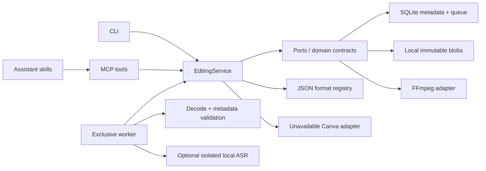

# Implemented architecture

The [full target architecture](../ARCHITECTURE.md) describes the long-term product. The current local composition is:

The composition root is `ove.application.bootstrap`. `EditingService` depends on protocols and receives adapters by injection. FFmpeg constructs commands from discriminated Pydantic operations. The MCP module does not import FFmpeg or compile filters. Skills contain workflow knowledge and reference only available tools or explain unavailable capabilities.

A render plan binds the source asset, ordered operations, intent effects, resolved export settings and engine fingerprint. Rendering is asynchronous through SQLite; terminal results and validation reports are retrieved separately. The worker is local and exclusive rather than a distributed lease scheduler. This avoids claiming multi-worker durability that has not been built.

Changes needed for a hosted release include an authenticated gateway, tenant-scoped repositories/storage, secure transfer endpoints, distributed job ownership and external credential management. No public deployment should be inferred from the presence of a Dockerfile or loopback HTTP transport.
